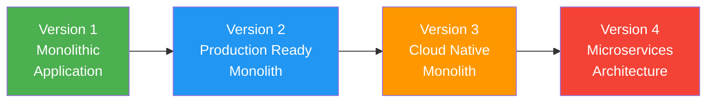
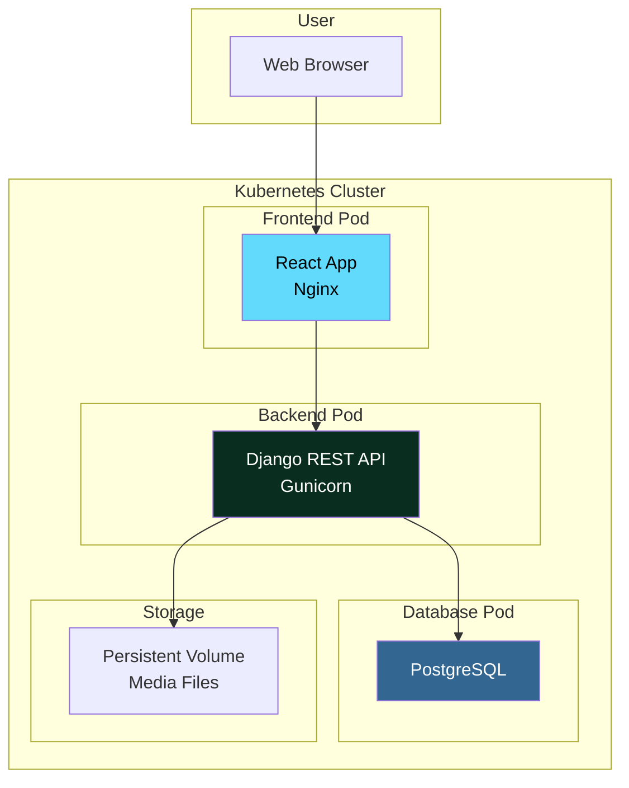
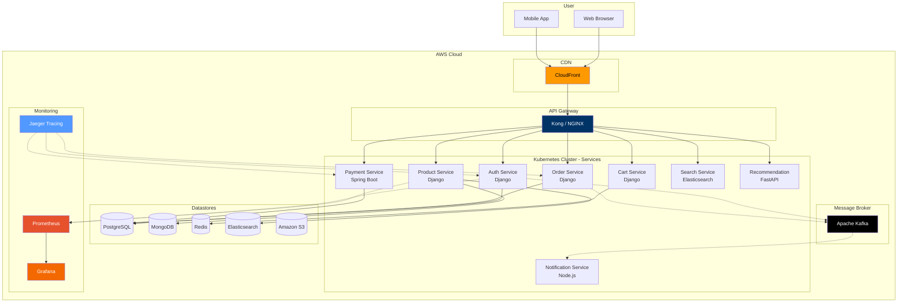

<p align="center">
  
  
  
  
  
  
  
</p>

<h1 align="center">🛒 Amazon Clone — Full Stack E-Commerce Platform</h1>

<p align="center">
  <strong>A production-grade e-commerce platform evolving from a monolithic full-stack application to a cloud-native microservices architecture.</strong>
</p>

<p align="center">
  Built with <strong>React</strong>, <strong>Django REST Framework</strong>, <strong>PostgreSQL</strong>, <strong>Docker</strong>, <strong>Kubernetes</strong>, and <strong>AWS</strong>.
  <br/>
  Designed to demonstrate progressive mastery of software engineering, cloud computing, and DevOps.
</p>

---

## 📋 Table of Contents

- [Project Overview](#-project-overview)
- [Technology Stack](#-technology-stack)
- [Development Roadmap](#-development-roadmap)
  - [Version 1 — Beginner E-Commerce Platform](#version-1--beginner-e-commerce-platform)
  - [Version 2 — Production Features](#version-2--production-features)
  - [Version 3 — Cloud Native Architecture](#version-3--cloud-native-architecture)
  - [Version 4 — Microservices Architecture](#version-4--microservices-architecture)
- [Architecture Evolution](#-architecture-evolution)
- [Repository Structure](#-repository-structure)
- [Quick Start](#-quick-start)
- [API Endpoints](#-api-endpoints)
- [Learning Objectives](#-learning-objectives)
- [Future Enhancements](#-future-enhancements)
- [License](#-license)

---

## 📖 Project Overview

This repository is a **graduated learning project** that builds an Amazon-inspired e-commerce platform across **four progressively advanced versions**. Each version introduces new architectural complexity, infrastructure improvements, and engineering best practices — from a beginner-friendly monolith to a production-grade microservices ecosystem.

**What makes this project unique?**

- ✅ **Incremental complexity** — Each version builds on the previous one
- ✅ **Real-world DevOps** — Docker, Kubernetes, CI/CD, and cloud-native practices
- ✅ **Portfolio ready** — Demonstrates full-stack, cloud, and DevOps skills
- ✅ **Recruiter focused** — Clear progression from junior to senior engineering concepts

---

## 🛠 Technology Stack

### Frontend

| Technology | Purpose |
|------------|---------|
| **React 19** | UI library for building component-based interfaces |
| **React Router v7** | Client-side routing and navigation |
| **Axios** | HTTP client for API communication with JWT interceptor |
| **Tailwind CSS v4** | Utility-first CSS framework for responsive design |
| **JavaScript (ES6+)** | Core frontend language |
| **HTML5 / CSS3** | Web standards |
| **react-hot-toast** | Toast notifications |
| **react-icons** | Icon library |

### Backend

| Technology | Purpose |
|------------|---------|
| **Python 3.14** | Core backend language |
| **Django 6.0** | High-level Python web framework |
| **Django REST Framework 3.17** | REST API toolkit for Django |
| **Django REST Framework SimpleJWT** | JWT authentication |
| **Django Filter** | Query parameter filtering |
| **CORS Headers** | Cross-origin resource sharing |

### Database

| Version | Database | Purpose |
|---------|----------|---------|
| V1 | **MongoDB** | Primary relational database |
| V2 | MongoDB + Redis (caching) | Production data + caching |
| V3 | MySQL + Redis + Elasticsearch | Polyglot persistence |
| V4 | PoatgreSQL | Distributed data |

### DevOps & Cloud

| Technology | Purpose |
|------------|---------|
| **Docker** | Containerization of frontend and backend |
| **Docker Compose** | Multi-container local development |
| **Kubernetes** | Container orchestration |
| **NGINX** | Reverse proxy and API gateway |
| **AWS EKS** | Managed Kubernetes on AWS |
| **AWS ECR** | Container image registry |
| **Amazon S3** | Object storage for media files |
| **CloudFront** | CDN for global content delivery |
| **GitHub Actions** | CI/CD pipeline (planned) |
| **Helm** | Kubernetes package manager (planned) |
| **Prometheus & Grafana** | Monitoring and observability (planned) |

---

## 🗺 Development Roadmap

This repository is developed across **four versions**, each representing a major milestone in engineering maturity.

<details>
<summary><strong>📌 Legend</strong></summary>

- ✅ **Completed** — Feature is implemented and tested
- 🔄 **In Progress** — Currently being developed
- 📅 **Planned** — Queued for future implementation

</details>

---

### Version 1 — Beginner E-Commerce Platform

> **Focus:** Full-stack fundamentals, Docker containerization, and Kubernetes deployment.
> **Status:** ✅ Complete

The foundation of the Amazon Clone. A monolithic Django backend serves a React frontend with all core e-commerce functionality. Both applications are fully containerized and deployable on Kubernetes.

<details>
<summary><strong>✅ View Version 1 Features</strong></summary>

#### Authentication

- [x] User Registration
- [x] Login / Logout
- [x] JWT Authentication (access + refresh tokens)
- [x] User Profile (view & update)

#### Products

- [x] Product Listing with pagination
- [x] Product Detail page
- [x] Product Categories
- [x] Search Products by name/description
- [x] Filter Products by category, featured status
- [x] Sort by price, rating, date, reviews

#### Shopping

- [x] Shopping Cart (add, update, remove items)
- [x] Wishlist (toggle add/remove)
- [x] Quantity update in cart

#### Orders

- [x] Place Order (from cart)
- [x] Order History
- [x] Order Details

#### Admin

- [x] Product Management (CRUD)
- [x] Category Management
- [x] Inventory Management
- [x] Order Management
- [x] User Management
- [x] Banner Management

#### DevOps

- [x] Dockerized frontend (React + Nginx)
- [x] Dockerized backend (Django + Gunicorn)
- [x] Docker Compose for local development
- [x] Kubernetes Deployment manifests
- [x] Kubernetes ConfigMaps for environment variables
- [x] Kubernetes Secrets for sensitive data
- [x] Persistent Volumes for database and media

</details>

---

### Version 2 — Production Features

> **Focus:** Payment integration, business workflows, and CI/CD pipelines.
> **Status:** 📅 Planned

Version 2 transforms the basic e-commerce platform into a production-ready system with real payment processing, automated workflows, and enterprise-grade infrastructure.

<details>
<summary><strong>📅 View Version 2 Planned Features</strong></summary>

#### Payment & Billing

- [ ] Online Payment Gateway Integration (Stripe / Razorpay)
- [ ] Billing System
- [ ] Invoice Generation (PDF)
- [ ] Shipping Address Management
- [ ] Coupon System
- [ ] Discounts & Promotions

#### Product Reviews

- [ ] Product Reviews
- [ ] Product Ratings (star-based)
- [ ] Review Moderation

#### Notifications & Communication

- [ ] Email Verification
- [ ] Password Reset (via email)
- [ ] Order Confirmation Emails
- [ ] Shipping Updates

#### Order Workflows

- [ ] Order Tracking
- [ ] Returns & Refund Workflow
- [ ] Inventory Alerts (low stock)

#### Dashboards & Analytics

- [ ] Seller Dashboard
- [ ] Analytics Dashboard
- [ ] Admin Reports (sales, inventory, users)

#### Infrastructure Improvements

- [ ] CI/CD Pipeline (GitHub Actions)
- [ ] NGINX Reverse Proxy
- [ ] SSL/TLS (Let's Encrypt)
- [ ] Centralized Logging
- [ ] Application Monitoring
- [ ] Docker Image Optimization (multi-stage builds)

</details>

---

### Version 3 — Cloud Native Architecture

> **Focus:** AWS cloud services, polyglot persistence, and observability.
> **Status:** 📅 Planned

Version 3 elevates the application to run natively on AWS with a multi-database strategy, caching layer, full-text search, and production-grade monitoring.

<details>
<summary><strong>📅 View Version 3 Planned Features</strong></summary>

#### Database Upgrades

| Database | Purpose | Status |
|----------|---------|--------|
| **PostgreSQL** | Primary relational data (users, orders) | ✅ Existing |
| **MongoDB** | Product catalog, reviews, flexible schemas | 📅 Planned |
| **Redis** | Session caching, rate limiting, queue | 📅 Planned |
| **Elasticsearch** | Full-text product search | 📅 Planned |

#### AWS Cloud Services

- [ ] **Amazon EKS** — Managed Kubernetes cluster
- [ ] **Amazon ECR** — Container image registry
- [ ] **Amazon S3** — Media file storage (images, invoices)
- [ ] **CloudFront** — CDN for global content delivery
- [ ] **IAM** — Identity and access management
- [ ] **VPC** — Virtual private cloud networking
- [ ] **Auto Scaling** — Dynamic pod scaling
- [ ] **Load Balancer** — Application load balancing
- [ ] **Secrets Manager** — Secure credential storage

#### Kubernetes Enhancements

- [ ] Horizontal Pod Autoscaler (HPA)
- [ ] Resource Limits & Requests
- [ ] Rolling Updates
- [ ] Blue-Green Deployment strategy
- [ ] Canary Deployment strategy

#### Performance

- [ ] Redis Caching for frequent queries
- [ ] Image Optimization (WebP, lazy loading)
- [ ] CDN Integration (CloudFront)
- [ ] Background Workers (Celery)
- [ ] Async Task Queue

#### Monitoring & Observability

- [ ] Prometheus Metrics Collection
- [ ] Grafana Dashboards
- [ ] Centralized Logging (ELK Stack)

</details>

---

### Version 4 — Microservices Architecture

> **Focus:** Service decomposition, event-driven architecture, and distributed systems.
> **Status:** 📅 Planned

Version 4 decomposes the monolithic Django application into independent microservices, each owning its data and domain logic. Different services may use different technologies best suited to their requirements.

<details>
<summary><strong>📅 View Version 4 Planned Architecture</strong></summary>

#### Service Breakdown

| Service | Technology | Responsibility |
|---------|-----------|----------------|
| **API Gateway** | NGINX / Kong | Routing, auth, rate limiting |
| **Auth Service** | Django | User registration, login, JWT |
| **Product Service** | Django | Product catalog, categories, search |
| **Inventory Service** | Django / FastAPI | Stock management, low-stock alerts |
| **Cart Service** | Django | Shopping cart operations |
| **Order Service** | Django | Order placement, history, tracking |
| **Payment Service** | Spring Boot | Payment processing, refunds |
| **Notification Service** | Node.js | Email, SMS, push notifications |
| **Shipping Service** | Python | Shipping calculations, tracking |
| **Recommendation Service** | Python FastAPI | AI-based product recommendations |
| **Search Service** | Elasticsearch | Full-text product search |
| **Analytics Service** | Python | Sales, user behavior, reporting |

#### Infrastructure & DevOps

| Component | Technology |
|-----------|-----------|
| **Container Orchestration** | Kubernetes |
| **Message Broker** | RabbitMQ / Apache Kafka |
| **Service Mesh** | Istio (future) |
| **API Gateway** | NGINX / Kong |
| **Monitoring** | Prometheus + Grafana |
| **Distributed Tracing** | Jaeger |
| **CI/CD** | GitHub Actions + Argo CD |
| **Infrastructure as Code** | Terraform |

</details>

---

## 🏛 Architecture Evolution



### Current Deployment Architecture (Version 1)



### Future Deployment Architecture (Version 4)



---

## 📁 Repository Structure

```
amazon-clone/
├── frontend/                       # React + Vite + Tailwind frontend
│   ├── public/                     # Static assets
│   ├── src/
│   │   ├── components/             # Reusable UI components
│   │   │   ├── Navbar.jsx          # Top navigation with search
│   │   │   ├── Footer.jsx          # Site footer
│   │   │   └── ProductCard.jsx     # Product card with image fallback
│   │   ├── context/
│   │   │   └── AuthContext.jsx     # Authentication state management
│   │   ├── pages/
│   │   │   ├── Home.jsx            # Landing page with banners + featured
│   │   │   ├── Shop.jsx            # Product listing with filters
│   │   │   ├── ProductDetail.jsx   # Single product view
│   │   │   ├── Cart.jsx            # Shopping cart
│   │   │   ├── Wishlist.jsx        # Saved items
│   │   │   ├── Orders.jsx          # Order history
│   │   │   ├── Checkout.jsx        # Shipping + payment
│   │   │   ├── Login.jsx           # Sign in
│   │   │   └── Register.jsx        # Sign up
│   │   ├── services/
│   │   │   └── api.js              # Axios with JWT interceptor
│   │   ├── App.jsx                 # Root with routing
│   │   ├── main.jsx                # Entry point
│   │   └── index.css               # Tailwind + global styles
│   ├── Dockerfile                  # Frontend container
│   ├── nginx.conf                  # Nginx configuration
│   ├── vite.config.js              # Vite + proxy config
│   └── package.json
│
├── backend/                        # Django REST Framework backend
│   ├── config/                     # Django project configuration
│   │   ├── settings.py             # App config, JWT, CORS, DRF, DB
│   │   ├── urls.py                 # Root URL routing
│   │   ├── wsgi.py                 # WSGI entry point
│   │   └── db.py                   # MongoDB connection (V3+)
│   ├── core/                       # Authentication app
│   │   ├── serializers.py          # Register/Login serializers
│   │   ├── views.py                # Auth views
│   │   └── urls.py                 # /api/auth/ endpoints
│   ├── products/                   # Products app
│   │   ├── models.py               # Product, Category, Banner models
│   │   ├── serializers.py          # Product serializers
│   │   ├── views.py                # Product CRUD + filtering
│   │   ├── urls.py                 # /api/ products endpoints
│   │   ├── admin.py                # Admin configuration
│   │   └── management/commands/
│   │       └── seed_images.py      # Seed relevant product images
│   ├── cart/                       # Shopping cart app
│   ├── wishlist/                   # Wishlist app
│   ├── orders/                     # Orders app
│   ├── manage.py                   # Django management script
│   ├── requirements.txt            # Python dependencies
│   ├── Dockerfile                  # Backend container
│   └── entrypoint.sh               # Container entry script
│
├── k8s/                            # Kubernetes manifests
│   ├── frontend-deployment.yaml    # Frontend deployment + service
│   ├── backend-deployment.yaml     # Backend deployment + service
│   ├── postgres-deployment.yaml    # PostgreSQL statefulset
│   ├── configmap.yaml              # Environment configuration
│   ├── secret.yaml                 # Sensitive data (template)
│   ├── pvc.yaml                    # Persistent volume claims
│   └── ingress.yaml                # Ingress controller
│
├── docker/                         # Docker compose files
│   ├── docker-compose.yml          # Local development
│   └── docker-compose.prod.yml     # Production build
│
├── docs/                           # Documentation (planned)
│
├── scripts/                        # Utility scripts
│   ├── seed.sh                     # Database seeding
│   └── deploy.sh                   # Deployment helper
│
├── .github/workflows/              # CI/CD pipelines (planned)
│   └── ci-cd.yml                   # GitHub Actions workflow
│
├── .gitignore
├── LICENSE
└── README.md                       # This file
```

---

## 🚀 Quick Start

### Prerequisites

- **Python 3.10+** with pip
- **Node.js 18+** with npm
- **Docker** & **Docker Compose** (for containerized setup)
- **PostgreSQL** (or use the Docker Compose setup)

### Option 1: Local Development

#### Backend Setup

```bash
cd backend
python -m venv venv

# Windows
venv\Scripts\activate
# macOS/Linux
# source venv/bin/activate

pip install -r requirements.txt
python manage.py migrate
python manage.py createsuperuser
python manage.py seed_images     # Populate product images
python manage.py runserver
```

#### Frontend Setup

```bash
cd frontend
npm install
npm run dev
```

The Vite dev server proxies `/api` and `/media` requests to Django at `http://127.0.0.1:8000`.

### Option 2: Docker Compose (Recommended)

```bash
docker-compose up --build
```

This starts:
- **Frontend** at `http://localhost:3000` (via Nginx)
- **Backend** at `http://localhost:8000`
- **PostgreSQL** at `localhost:5432`

### Option 3: Kubernetes Deployment

```bash
# Apply ConfigMap and Secret first
kubectl apply -f k8s/configmap.yaml
kubectl apply -f k8s/secret.yaml

# Deploy database
kubectl apply -f k8s/pvc.yaml
kubectl apply -f k8s/postgres-deployment.yaml

# Deploy backend and frontend
kubectl apply -f k8s/backend-deployment.yaml
kubectl apply -f k8s/frontend-deployment.yaml

# Apply ingress
kubectl apply -f k8s/ingress.yaml
```

---

## 📡 API Endpoints

### Authentication (`/api/auth/`)

| Method | Endpoint | Auth | Description |
|--------|----------|------|-------------|
| POST | `/api/auth/register/` | No | Create account |
| POST | `/api/auth/login/` | No | Login |
| POST | `/api/auth/logout/` | Yes | Logout |
| GET/PUT | `/api/auth/profile/` | Yes | Get/update profile |
| POST | `/api/auth/token/refresh/` | No | Refresh JWT |

### Products (`/api/`)

| Method | Endpoint | Auth | Description |
|--------|----------|------|-------------|
| GET | `/api/categories/` | No | List categories |
| GET | `/api/categories/<slug>/` | No | Category detail |
| GET | `/api/products/` | No | List products |
| GET | `/api/products/featured/` | No | Featured products |
| GET | `/api/products/<slug>/` | No | Product detail |
| GET | `/api/banners/` | No | Homepage banners |

### Cart (`/api/cart/`)

| Method | Endpoint | Auth | Description |
|--------|----------|------|-------------|
| GET | `/api/cart/` | Yes | View cart |
| POST | `/api/cart/` | Yes | Add item |
| PUT | `/api/cart/items/<id>/` | Yes | Update quantity |
| DELETE | `/api/cart/items/<id>/` | Yes | Remove item |

### Wishlist (`/api/wishlist/`)

| Method | Endpoint | Auth | Description |
|--------|----------|------|-------------|
| GET | `/api/wishlist/` | Yes | View wishlist |
| POST | `/api/wishlist/` | Yes | Toggle product |
| DELETE | `/api/wishlist/` | Yes | Remove product |

### Orders (`/api/orders/`)

| Method | Endpoint | Auth | Description |
|--------|----------|------|-------------|
| GET | `/api/orders/` | Yes | List orders |
| POST | `/api/orders/` | Yes | Create order |
| GET | `/api/orders/<id>/` | Yes | Order detail |

### Admin (`/admin/`)

| Method | Endpoint | Auth | Description |
|--------|----------|------|-------------|
| GET | `/admin/` | Admin | Django admin panel |

### Product Query Parameters

```
GET /api/products/?search=headphones&category=1&is_featured=true&ordering=-price&page=1
```

| Parameter | Description |
|-----------|-------------|
| `?search=<keyword>` | Search by name/description |
| `?category=<id>` | Filter by category |
| `?is_featured=true` | Filter featured only |
| `?ordering=price` | Sort ascending |
| `?ordering=-price` | Sort descending |
| `?ordering=-rating` | Sort by highest rating |
| `?page=<number>` | Pagination (20/page) |

---

## 🎯 Learning Objectives

Each version of this project demonstrates increasing proficiency in:

| Skill Area | V1 | V2 | V3 | V4 |
|------------|:--:|:--:|:--:|:--:|
| **Python / Django** | ✅ | ✅ | ✅ | ✅ |
| **React / JavaScript** | ✅ | ✅ | ✅ | ✅ |
| **REST API Design** | ✅ | ✅ | ✅ | ✅ |
| **PostgreSQL / SQL** | ✅ | ✅ | ✅ | ✅ |
| **Database Design** | ✅ | ✅ | ✅ | ✅ |
| **JWT Authentication** | ✅ | ✅ | ✅ | ✅ |
| **Docker** | ✅ | ✅ | ✅ | ✅ |
| **Docker Compose** | ✅ | ✅ | ✅ | ✅ |
| **Kubernetes** | ✅ | ✅ | ✅ | ✅ |
| **CI/CD** | 📅 | ✅ | ✅ | ✅ |
| **Payment Integration** | — | ✅ | ✅ | ✅ |
| **Email & Notifications** | — | ✅ | ✅ | ✅ |
| **AWS Cloud Services** | — | — | ✅ | ✅ |
| **Redis Caching** | — | — | ✅ | ✅ |
| **Elasticsearch** | — | — | ✅ | ✅ |
| **MongoDB** | — | — | ✅ | ✅ |
| **Monitoring (Prometheus/Grafana)** | — | — | ✅ | ✅ |
| **Microservices** | — | — | — | ✅ |
| **Event-Driven Architecture** | — | — | — | ✅ |
| **Distributed Systems** | — | — | — | ✅ |
| **Service Mesh (Istio)** | — | — | — | 📅 |
| **Infrastructure as Code (Terraform)** | — | — | 📅 | ✅ |

**Legend:** ✅ Completed · 📅 Planned · — Not applicable

---

## 🔮 Future Enhancements

Beyond the four roadmap versions, the following enhancements are under consideration:

<details>
<summary><strong>✨ View Future Ideas</strong></summary>

### Artificial Intelligence
- [ ] **AI Product Recommendations** — Personalized suggestions based on browsing history
- [ ] **AI Shopping Assistant** — Conversational chatbot for product discovery
- [ ] **Voice Search** — Natural language product search

### User Experience
- [ ] **Multi-language Support** — i18n for global audiences
- [ ] **Real-time Chat** — Customer support live chat
- [ ] **Live Order Tracking** — Real-time delivery tracking map
- [ ] **OCR-based Invoice Processing** — Automated invoice data extraction

### Architecture & Infrastructure
- [ ] **Event-driven Architecture** — Async event processing with Kafka
- [ ] **Multi-region Deployment** — Active-active across AWS regions
- [ ] **Disaster Recovery** — Automated failover and backup strategies
- [ ] **GitOps with Argo CD** — Declarative continuous delivery
- [ ] **Helm Charts** — Kubernetes package management
- [ ] **Service Mesh with Istio** — Advanced traffic management
- [ ] **Full Observability** — Logs, metrics, traces (three pillars)

### Infrastructure as Code
- [ ] **Terraform** — Provision AWS infrastructure declaratively
- [ ] **Terragrunt** — DRY IaC management

</details>

---

## 📄 License

This project is developed for **educational and portfolio purposes**. It is not affiliated with or endorsed by Amazon.

---

<p align="center">
  <strong>Built with ❤️ to demonstrate the journey from junior to senior engineering.</strong>
  <br/><br/>
  <a href="#-table-of-contents">Back to Top ↑</a>
</p>
